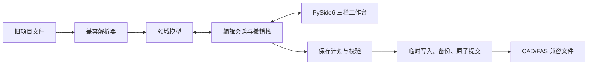

# 钻孔数据编辑工具 v3 重构设计

## 1. 背景

项目现有 `v2/` 是基于 Python 3.10+、PySide6 和 openpyxl 的 Windows 桌面应用。它已经具备钻孔项目加载、编辑、校验、撤销恢复、文件保存、Excel 导入导出和标贯分析等能力，但目前存在以下主要问题：

- `src/borehole/ui/main_window.py` 约 1200 行，同时承担界面组装、项目状态、文件生命周期、后台任务和大量业务操作。
- 领域、应用、基础设施和界面边界虽然已经初步形成，但编辑状态和文件操作仍大量集中在主窗口。
- 现有测试仅覆盖 31 个领域模型、校验器和撤销管理器用例，缺少文件兼容、导入导出、事务保存和 UI 交互测试。
- 当前质量基线包含 42 项 Ruff 问题和 51 项 mypy 问题。
- 表格录入、跨单元格粘贴、键盘导航和批量行操作不足，影响日常编辑效率。

`v3` 的目标是在不修改、不删除 `v2/` 的前提下，建立独立的新版本，并严格保持现有项目文件和 CAD/FAS 成图流程兼容。

## 2. 目标与非目标

### 2.1 目标

1. 在项目根目录创建完全独立的 `v3/`，包含源码、测试、开发入口、依赖配置、打包配置和说明文档。
2. 保持 `v2` 支持的项目文件、编码、结束标记和 CAD/FAS 输出行为兼容。
3. 将项目生命周期、编辑会话、撤销恢复、保存事务和 UI 事件从主窗口拆分到清晰的模块。
4. 采用三栏工作台，重点改善表格化高效录入。
5. 建立文件兼容、事务保存、应用用例和 PySide6 表格交互的自动化回归测试。
6. 使 `pytest`、Ruff 和 mypy 在 `v3` 范围内全部通过，并提供可启动的 Windows EXE。

### 2.2 非目标

- 不修改、删除或重新格式化 `v2/` 中的任何文件。
- 不引入数据库、新项目格式、云同步、多人协作或本地 Web 服务。
- 不扩张为批量数据处理平台；搜索和批量能力只实现三栏工作台正常使用所需的基础范围。
- 不改变现有钻孔业务规则、文件命名规则或 CAD/FAS 接口。
- 不为了视觉变化重写稳定的领域规则；重构必须服务于边界、可测试性和编辑效率。

## 3. 版本隔离

`v3/` 不在运行时导入 `v2/`。可以在开发和测试阶段将 `v2` 作为行为参考，但发布后的 `v3` 必须自包含。

开始实现前，对 `v2/` 的全部文件生成路径、大小和 SHA-256 清单。完成验收时重新生成并比较清单，任何缺失或哈希变化都视为失败。所有真实项目冒烟测试只读取原项目，并在临时副本中执行写入操作。

## 4. 总体架构

`v3` 采用四个边界：

### 4.1 领域层

负责钻孔、主文件字段、地层、试验记录、剖面文件、项目文件和校验结果等纯数据与规则。领域层不得依赖 PySide6、文件系统或 openpyxl。

### 4.2 应用层

负责可由界面调用的用例：

- 打开、关闭和重新加载项目。
- 选择、新增、复制、重命名和删除钻孔或剖面文件。
- 管理当前编辑会话、脏状态和跨字段联动。
- 将一次多单元格粘贴、多行插入或多行删除组织成一个撤销事务。
- 生成保存计划、执行校验并协调后台任务。

应用层通过协议依赖项目仓库和外部服务，不直接依赖具体文件实现。

### 4.3 基础设施层

负责：

- 旧项目目录发现与文件分类。
- UTF-8、GBK、换行风格和结束标记的解析与渲染。
- 主文件、`.-b/c/d/g/h`、试验文件、未知附属文件、剖面文件和 `0` 开头项目文件的读写。
- 保存计划的临时文件、备份、原子替换和失败回滚。
- Excel/CSV 导入、Excel/CSV 导出、设置持久化和标贯分析所需适配器。

### 4.4 界面层

主窗口只组装菜单、工具栏、三栏工作台和应用控制器。项目导航、中间编辑工作区、右侧上下文面板、表格模型、对话框和后台任务适配器各自独立。

## 5. 界面设计

### 5.1 左栏：项目导航

- 按项目文件、剖面文件、NZK 和 ZK 分组。
- 显示当前选择、未保存状态和错误状态。
- 保留上下文菜单，并提供紧凑的新增、复制和删除命令入口。
- 选择新钻孔时先提交当前单元格编辑，再切换编辑会话。

### 5.2 中栏：集中编辑区

提供五类视图：

1. 基本信息。
2. 分层数据。
3. 试验数据。
4. 文件内容，包括原始文本和额外文件。
5. 分析，包括标贯分析和校验结果。

中栏是日常操作主区域。原始文本和校验信息保留完整能力，但不占据默认编辑焦点。

### 5.3 右栏：上下文面板

只显示当前钻孔摘要、未保存项、校验问题和快速跳转。校验问题必须能够定位到对应字段、表格单元格或文件视图。右栏不承载第二套编辑表单。

## 6. 表格录入行为

表格体验是 `v3` 的优先改进项：

- `Tab`、`Enter` 和方向键支持连续编辑，并保持选择与滚动位置稳定。
- 支持矩形区域复制与粘贴，以及从 Excel 粘贴以制表符和换行分隔的多行多列数据。
- 当粘贴区域超出现有行数时，在允许新增记录的表格中自动补足行；列数超出目标模型时拒绝粘贴并给出非阻塞错误。
- 支持选中多行后在上方或下方插入、删除和清空。
- 多单元格粘贴、多行插入、多行删除分别构成单次撤销操作。
- 数值字段采用统一显示格式，但领域模型和兼容渲染器保留旧文件所需的文本语义。
- 试验深度同步等跨表联动由应用层服务处理，表格模型不直接修改其他模型。
- 校验结果通过单元格状态、工具提示和右侧问题列表呈现，避免每次编辑弹出模态对话框。

## 7. 文件兼容规则

1. 未编辑文件保持原始字节不变。打开、校验和关闭项目不得触发写入。
2. 编辑后的文件保持原编码和换行风格；无法可靠识别时采用与 `v2` 一致的 UTF-8 回退策略并明确报告。
3. 文件结束标记、字段顺序、空值、省略规则和文件命名由兼容渲染器集中控制。
4. 未知附属文件按原内容保留，除非用户明确编辑或删除。
5. 重命名、删除和清空已有试验文件必须备份原文件。
6. 保存结果必须继续可被现有 CAD/FAS 插件读取。

## 8. 事务保存

保存按以下顺序执行：

1. 编辑器提交活动单元格，应用层冻结本次保存快照。
2. 根据脏状态生成明确的创建、替换、删除和重命名计划。
3. 在内存中渲染目标内容，并运行保存前校验。
4. 将全部新内容写入目标目录内的唯一临时文件，确保原子替换位于同一文件系统。
5. 把将被替换或删除的原文件备份到项目 `tmp/`，备份名包含时间与防冲突序号。
6. 提交原子替换和删除操作。
7. 任一步失败时停止后续提交，并使用本次备份恢复已提交项目；应用状态继续标记为未保存。
8. 全部成功后才清除对应脏状态，并刷新右栏摘要。

后台保存期间禁用与项目结构或数据写入冲突的命令，但允许浏览当前已加载数据。关闭窗口或切换项目时，存在未保存改动必须明确确认。

## 9. 错误处理

基础设施错误统一转换为带文件路径、操作类型、用户可读说明和原始异常信息的应用错误。至少区分：

- 路径不存在或不是目录。
- 读取或写入权限不足。
- 编码或文件结构无法解析。
- Excel/CSV 表结构不受支持。
- 临时写入、备份、原子替换或回滚失败。
- 后台任务取消或异常退出。

单个文件损坏时，不允许应用无提示崩溃。项目可进入诊断状态：未受影响的数据可读，损坏文件列在右侧问题面板中；只有无法安全确定保存范围时才禁止保存。

## 10. 测试策略

### 10.1 特征与格式测试

- 使用不含真实项目隐私数据的合成旧格式样本记录 `v2` 当前解析和输出行为。
- 覆盖 UTF-8、GBK、CRLF、LF、空字段、结束标记、未知附属文件及所有已知后缀。
- 固定样本的期望内容存入 `v3/tests/fixtures/`，`v3` 测试不得依赖运行时导入 `v2`。

### 10.2 往返与事务测试

- 只加载不编辑时，项目目录零变化。
- 编辑一个字段时，只改变保存计划指定的文件。
- 覆盖创建、替换、清空、重命名和删除。
- 注入临时写入、备份和提交失败，验证原文件恢复且脏状态保留。

### 10.3 应用层测试

- 覆盖项目打开与切换、钻孔增删复制和重命名。
- 覆盖编辑会话、字段联动、脏状态和撤销恢复。
- 覆盖校验问题到字段或单元格位置的映射。

### 10.4 UI 交互测试

使用 `pytest-qt` 覆盖：

- 多行多列复制粘贴和自动补行。
- 键盘连续编辑与稳定焦点。
- 多行插入、删除和清空。
- 一次批量操作对应一次撤销。
- 切换钻孔前提交活动编辑。
- 从右侧校验问题跳转到目标单元格。

### 10.5 实际项目冒烟测试

现有示例项目只作为只读输入。每次测试先复制到临时目录，再执行加载、编辑、保存和重新加载。原项目目录不得出现任何时间戳、大小或哈希变化。

## 11. 交付与质量门槛

`v3/` 包含：

- `pyproject.toml` 和 `src/` 布局。
- 双击或命令行开发入口。
- 单元、集成和 UI 测试。
- PyInstaller spec 与 Windows 打包脚本。
- README，说明运行、测试、打包和兼容范围。

验收条件：

1. `v3` 全量 `pytest` 通过。
2. `v3` Ruff 检查零错误。
3. `v3` mypy 检查零错误。
4. Windows EXE 构建成功并通过启动冒烟测试。
5. 合成旧格式样本和实际项目临时副本的兼容回归通过。
6. `v2/` 实施前后 SHA-256 清单完全一致，且没有文件被新增、修改或删除。
7. 三栏工作台和表格关键流程通过桌面尺寸下的人工与自动化检查，无文本遮挡或控件重叠。

## 12. 已确认决策

- 重构范围：保持文件格式与功能兼容，同时改善界面和操作体验。
- 兼容等级：严格兼容。
- 主要体验目标：表格化高效录入。
- 技术形态：Windows + Python/PySide6 桌面应用，可打包为单机 EXE。
- 主布局：三栏工作台。
- 实现路径：兼容核心 + 重建应用层和界面。
